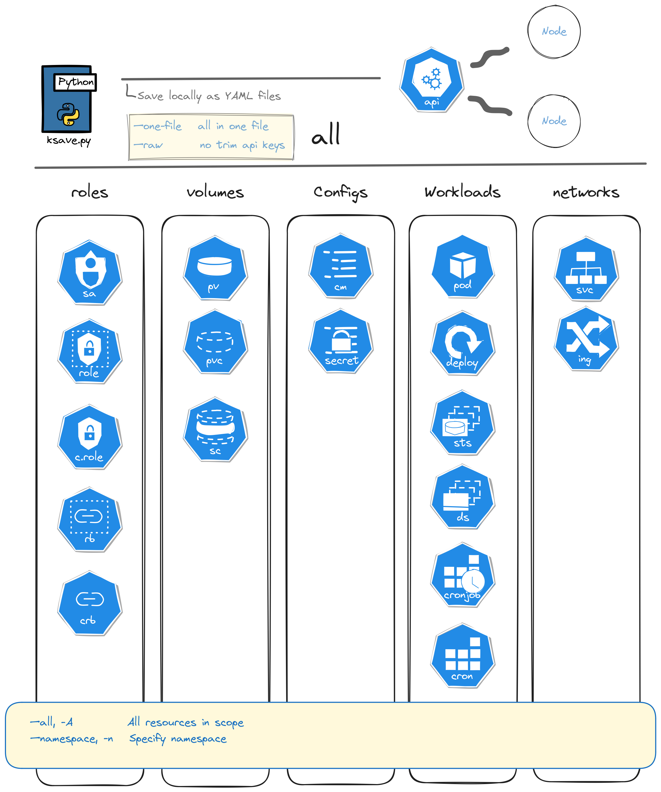

# KSave

`ksave.py` is a command-line interface (CLI) tool for backing up Kubernetes objects in YAML format. It supports various Kubernetes object types, such as Pods, Deployments, DaemonSets, Secrets, and more ...

[](https://www.python.org/downloads/release/python-360/)



## Usage

### Command:

```bash
ksave.py <object_type> <object_name> [options] > <output_file>
```

### Supported Object Types:

-`pods`:                    Back up your Kubernetes Pod objects  
-`deployments`:             Back up your Kubernetes Deployments objects  
-`daemonsets`:              Back up your Kubernetes Daemonsets objects  
-`statefulsets`:            Back up your Kubernetes Statefulsets objects  
-`cronjobs`:                Back up your Kubernetes CronJob objects  
-`jobs`:                    Back up your Kubernetes Job objects  
-`secrets`:                 Back up your Kubernetes Secrets objects  
-`configmaps`:              Back up your Kubernetes ConfigMap objects  
-`ingress`:                 Back up your Kubernetes Ingress objects  
-`services`:                Back up your Kubernetes Services objects  
-`storageclass`:            Back up your Kubernetes StorageClass objects  
-`persistentvolumes`:       Back up your Kubernetes PersistentVolume objects  
-`peristentvolumeclaims`:   Back up your Kubernetes PersistentVolumeClaim objects  
-`serviceaccount`:          Back up your Kubernetes ServiceAccount objects  
-`roles`:                   Back up your Kubernetes Role objects  
-`rolebindings`:            Back up your Kubernetes RoleBinding objects  
-`clusterroles`:            Back up your Kubernetes ClusterRole objects  
-`clusterrolebindings`:     Back up your Kubernetes ClusterRoleBinding objects  

### Options:

- `--namespace <namespace>`: Specify the namespace of the Kubernetes object.
- `--all`: Backup objects from all namespaces.


### Examples:

   To backup a specific Pod object:

```bash
ksave.py pods my_pod > my_pod.backup.yaml
```

   To backup a Deployment object in a specific namespace:

```bash
ksave.py deployments my_deployment --namespace my_namespace > my_deployment.my_namespace.backup.yaml
```

   To backup all DaemonSet objects:

```bash
ksave.py daemonsets --all > all_daemonsets.backup.yaml
```

   To backup a Secret object:

```bash
ksave.py secrets my_secret > my_secret.backup.yaml
```

### Help:

To display this help message and see all available options, use the `--help` flag:

```bash
ksave.py --help
```

### Sample --help Output:

```plaintext
Usage: ksave [-h] {pods,deployments,daemonsets,statefulsets,cronjobs,jobs,secrets,configmaps,ingress,services,storageclass,persistentvolumes,peristentvolumeclaims,serviceaccount,roles,rolebindings,clusterroles,clusterrolebindings} ...

positional arguments:
  {pods,deployments,daemonsets,statefulsets,cronjobs,jobs,secrets,configmaps,ingress,services,storageclass,persistentvolumes,peristentvolumeclaims,serviceaccount,roles,rolebindings,clusterroles,clusterrolebindings}
                        sub-command help
    pods                Back up your Kubernetes Pod objects
    deployments         Back up your Kubernetes Deployments objects
    daemonsets          Back up your Kubernetes Daemonsets objects
    statefulsets        Back up your Kubernetes Statefulsets objects
    cronjobs            Back up your Kubernetes CronJob objects
    jobs                Back up your Kubernetes Job objects
    secrets             Back up your Kubernetes Secrets objects
    configmaps          Back up your Kubernetes ConfigMap objects
    ingress             Back up your Kubernetes Ingress objects
    services            Back up your Kubernetes Services objects
    storageclass        Back up your Kubernetes StorageClass objects
    persistentvolumes   Back up your Kubernetes PersistentVolume objects
    peristentvolumeclaims
                        Back up your Kubernetes PersistentVolumeClaim objects
    serviceaccount      Back up your Kubernetes ServiceAccount objects
    roles               Back up your Kubernetes Role objects
    rolebindings        Back up your Kubernetes RoleBinding objects
    clusterroles        Back up your Kubernetes ClusterRole objects
    clusterrolebindings
                        Back up your Kubernetes ClusterRoleBinding objects

options:
  -h, --help            show this help message and exit
```

## Installation

To activate individual virtual environment:

```bash
pip install virtualenv 
```

To create and start in project root:

```bash
virtualenv venv
source venv/bin/activate
```

Install dependencies in virtual environment:

```bash
pip install -r requirements.txt
```

## Documentation

In this project, the [Kubernetes Python Client](https://github.com/kubernetes-client/python) proposed by kubernetes.io was used.  
Kubernetes Python Client API Endpoint List -- [Referance List](https://github.com/kubernetes-client/python/blob/36cfbe68a509d9b9d33395b22b6fa94d7d46c30f/kubernetes/README.md)  
This CLI application is coded with [arge-parse ](https://github.com/serbayacar/passkeepPy/blob/master/LICENSE.gpl).
